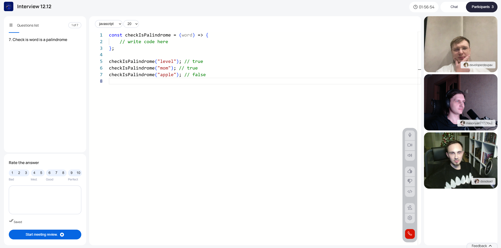

# 🚀 A platform for interviews and meetings

Welcome to the future of interviewing! 🎉 

This project is not just a platform, but a powerful tool for organizing and conducting interviews and meetings. With its help you can easily create questions, conduct video meetings, write real-time code, evaluate candidates and analyze results. Everything you need for the perfect interview - in one place! 💼✨

---

## 🌟 Core Functions

### 📚 Question Catalog
Create, edit and manage interview questions. Single- or multiple-choice questions and code questions are supported.  

### 💡 Code Editor
Built-in code editor allows candidates to write and test code right during the interview. Perfect for technical interviews! 👨‍💻👩‍💻  

### 🎥 Video Chat
Clear and stable video chat for communicating with candidates. Real-time video and audio create the feeling of a face-to-face meeting.  

### 📅 Meeting Scheduler
A handy tool for scheduling interviews. Specify the date, time and duration of the meeting - and you're done!  

### 📊 Assessment and analytics
After the interview, you will receive detailed analytics: average score, scores for each question, comments and transcript of the discussion.  

### 🗣️ Speech Transcription
Everything that is said during the interview is automatically recorded in text form. No important detail will be missed!    

### 💬 Chat for communication
Text chat for room participants. Discuss issues, share opinions and coordinate the process.  

---

### 👥 Room Participants

There are three types of participants in each room:  

### 1. **Collaborator**.  
- Turns on the video camera and microphone.  
- Answers questions and solves problems.  
- The protagonist of the interview! 🎤 

### 2. **Interviewer**.  
- Manages the process: switches questions, turns on the code editor.  
- Writes feedback and assigns grades.  
- Can turn on video camera and microphone.  
- A true master of the interview! 🧑‍🏫  

### 3. **Viewer**  
- Observes the process without being able to intervene.  
- Sees the code editor and writes to the chat.  
- Quiet observer, but always in the loop! 👀  

---

## 🛠️ How does it work?

### 1. **Create a Room**  
Create a room, provide a name, select questions from the catalog, and schedule a meeting date and time.  

### 2. **Invite Participants**  
Send the room link to candidates and other participants.  

### 3. **Conduct the interview**. 
- Interviewee answers questions and solves problems.  
- Interviewees manage the process, score and write feedback.  
- The interviewee observes and can chat.  

### 4. **Completion and Analysis**  
After the meeting, interviewers see draft scores and write an overall comment. Once all feedback is submitted, the room closes and you get:  
- The candidate's average score.  
- The scores and comments for each question.  
- A transcription of the discussion.  

---

### Let's make the interview process easier, more efficient and more enjoyable! 🚀  
Join the project and help us improve the platform. Your contribution is important! 💪  
